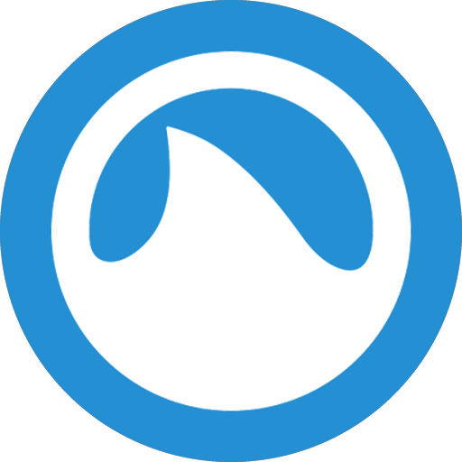
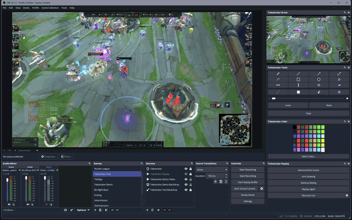
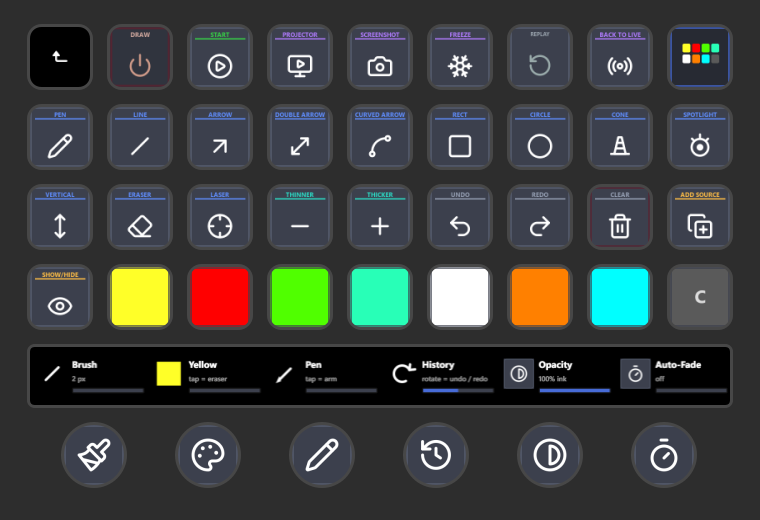

<p align="center">
  
</p>

<h1 align="center">OBS Telestrator</h1>

<p align="center">
  <strong>Draw on your live output in <a href="https://obsproject.com">OBS Studio</a>,<br>
  and mark up instant replays without leaving your scene.</strong>
</p>

<p align="center">
  <a href="#install">Install</a> •
  <a href="#quick-start">Quick start</a> •
  <a href="#tools">Tools</a> •
  <a href="#replay-markup">Replay markup</a> •
  <a href="#the-docks">Docks</a> •
  <a href="#hotkeys-and-controllers">Hotkeys &amp; controllers</a> •
  <a href="#build-from-source">Build</a>
</p>

<p align="center">
  
</p>

## What it is

A native C++ plugin for [OBS Studio](https://obsproject.com): a **Telestrator**
overlay source plus a set of docks in OBS's own theme. Circle a player, draw the
play, cone the vision, then clear it and call the next one. Ink composites into
your program feed in real time, so your stream and recording see exactly what
you draw.

## Install

1. Download `telestrator-x.y.z-windows-x64.zip` from
   [Releases](https://github.com/brendanwelsh/obs-telestrator/releases)
   (needs OBS Studio 31 or newer).
2. Close OBS and extract the zip into `C:\ProgramData\obs-studio\plugins\`
   (create the `plugins` folder if it doesn't exist). You should end up with
   `...\plugins\telestrator\bin\64bit\telestrator.dll`.
3. Start OBS. The **Telestrator** docks and the **Draw** pad appear
   automatically.

On macOS or Linux, [build from source](#build-from-source).

## Quick start

1. **Add to Current Scene** (Replay dock) drops the overlay on the current scene.
2. **Arm Drawing**.
3. Pick a tool and a color, then draw in the **Telestrator Draw** pad, a live
   view of your program that maps ink pixel-exact onto the canvas.

Undo, redo, and clear are one click or one hotkey away.

## Tools

| Icon | Tool | Notes |
|:---:|---|---|
|  | Pen | Freehand |
|  | Line | Straight line |
|  | Arrow | |
|  | Double arrow | |
|  | Curved arrow | Follows your drag, bows either way |
|  | Rectangle | |
|  | Ellipse | |
|  | Cone | Translucent vision wedge |
|  | Spotlight | Dims everything but a region |
|  | Horizontal line | Full-width guide |
|  | Vertical line | Full-height guide |
|  | Eraser | |

Styles: dashed, filled, highlighter, opacity, and an auto-fading laser. Colors
come from OBS's Select Color grid plus a full picker.

## Replay markup

The plugin drives OBS's **Replay Buffer**, so you can do the "let's look at that
again" segment live:

1. Turn the replay buffer on once in OBS (Settings → Output → Replay Buffer),
   then **Start Replay Buffer** in OBS's Controls dock.
2. Hit **Markup Replay**: the buffer saves and the clip fills your scene with the
   telestrator on top.
3. Draw on it. **Replay Again** restarts the clip.
4. **Resume Live** and you are back on the live feed. No scene switch.

## The docks

Four docks in OBS's theme, all state-synced (change a tool with a hotkey or a
Stream Deck and the docks follow):

- **Tools** — tool palette, style toggles, brush size, undo/redo/clear.
- **Color** — the Select Color swatch grid; the active ink is ringed.
- **Replay** — scene add/remove, arm, the replay flow, and settings.
- **Draw** — the drawing pad. Right-click for Fit or Fill; drag it out to float
  on its own monitor.

Prefer a projector? Enable the legacy projector input in settings (the gear in
the Replay dock).

## Hotkeys and controllers

Every command is an OBS hotkey (Settings → Hotkeys) under the stable
`telestrator.*` names, and those same names drive a **Stream Deck** over
obs-websocket, so a dock click, a hotkey, and a key press are interchangeable. A
dedicated **Ulanzi-dial plugin** is [planned](docs/ROADMAP.md). The full command
list is in [`docs/STREAMDECK-SPEC.md`](docs/STREAMDECK-SPEC.md).

<p align="center">
  
</p>

## Settings

The gear in the Replay dock: auto-fade after N seconds, armed indicator dot,
default ink opacity, and the legacy projector/preview input (off by default).

## Build from source

Based on the official
[obs-plugintemplate](https://github.com/obsproject/obs-plugintemplate). Windows
needs Visual Studio 2022 Build Tools (C++) and CMake:

```
cmake --preset windows-x64        # fetches libobs + Qt via buildspec.json
cmake --build --preset windows-x64
```

Output: `build_x64/rundir/RelWithDebInfo/telestrator.dll`, drop it into OBS's
`obs-plugins/64bit/`. macOS and Linux presets exist but are untested; the input
path is pure Qt, so porting help is welcome.

## Documentation

- [`CHANGELOG.md`](CHANGELOG.md) — release history
- [`CONTRIBUTING.md`](CONTRIBUTING.md) — building, style, the compat contract
- [`docs/STREAMDECK-SPEC.md`](docs/STREAMDECK-SPEC.md) — the command list
- [`docs/CONTROLLERS.md`](docs/CONTROLLERS.md) — controllers
- [`docs/ROADMAP.md`](docs/ROADMAP.md) — what's next

## Lineage and attribution

**obs-whiteboard** by **Herschel** is the original; **Tari** built the second.
**katarai** ported it to Lua as
[obs-whiteboard-lua](https://github.com/katarai/obs-whiteboard-lua). Brendan
built the telestrator on that (obs-telestrator-lua), and this is the native
C++/libobs port. The attribution rides along in [`LICENSE`](LICENSE) and the
source headers. MIT licensed; bundled GPLv2 components are listed in
[`THIRD_PARTY_NOTICES.md`](THIRD_PARTY_NOTICES.md).
